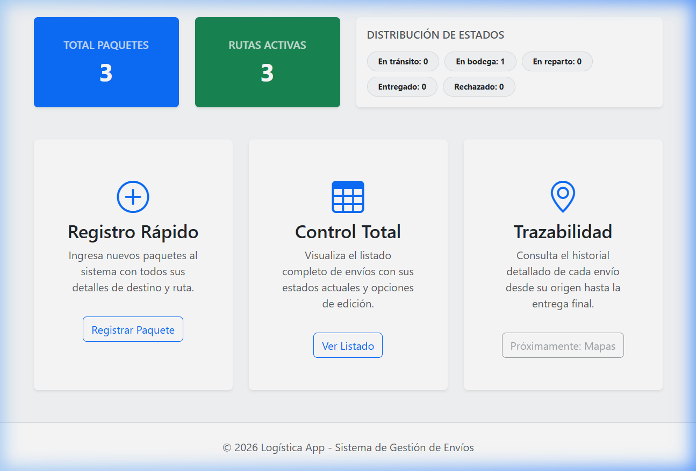
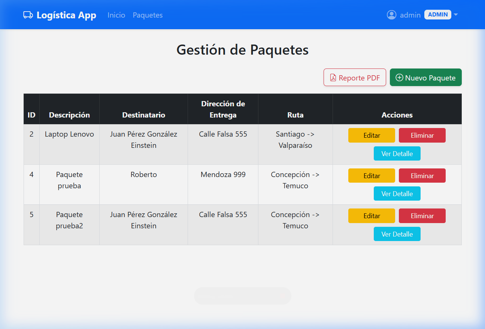
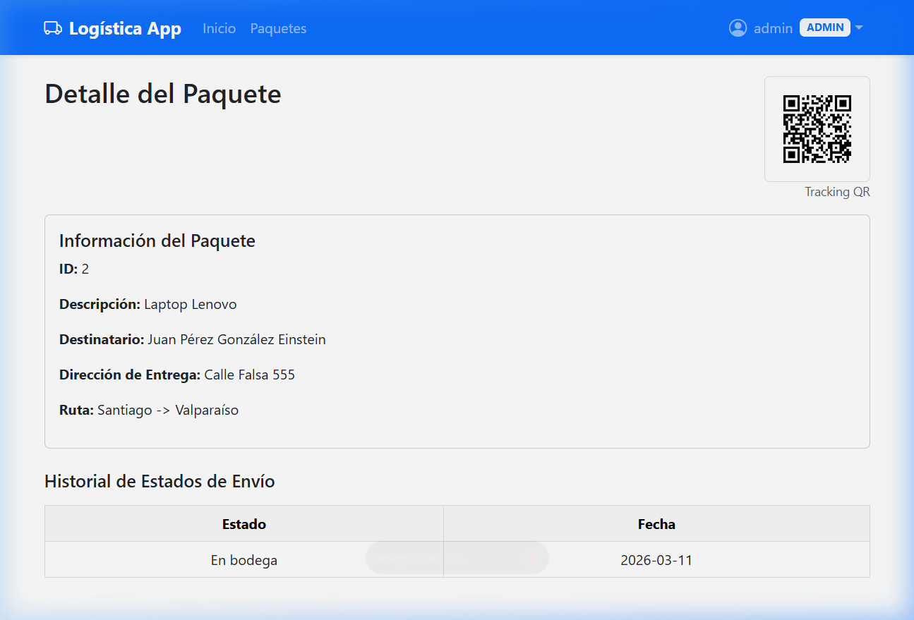
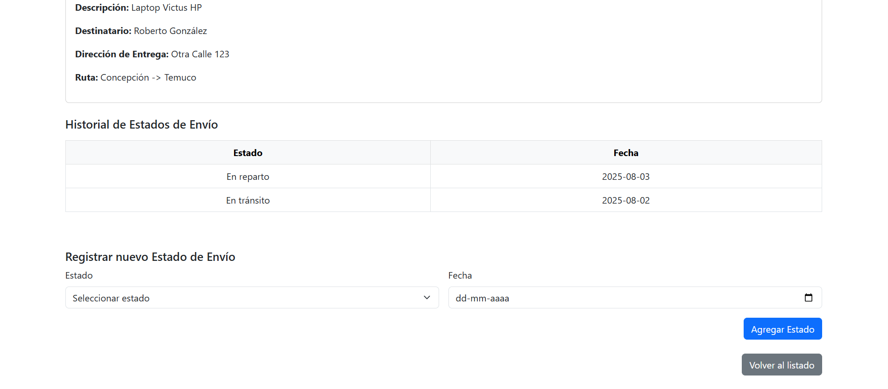

# 📦 Sistema de Gestión Logística - Modernización Spring Boot

Este es un sistema web industrial desarrollado con **Spring Boot 3.5.4**, **Thymeleaf** y **MySQL**. Ha sido modernizado para incluir un dashboard interactivo, seguridad por roles, generación de reportes PDF, notificaciones automáticas y seguimiento por códigos QR.

---

## 🚀 Funcionalidades Modernas

### 📊 Dashboard Interactivo (Fase 1)
- **Estadísticas en Tiempo Real**: Visualización dinámica de paquetes totales, rutas activas y estados de envío.
- **Gráficos de Distribución**: Resumen visual del estado de toda la logística.

### 🔐 Seguridad y roles (Fase 3)
- **Control de Acceso (RBAC)**: Sistema de autenticación con roles diferenciados.
    - **ADMIN**: Control total sobre paquetes, rutas, reportes y eliminación.
    - **OPERARIO**: Gestión de paquetes y actualizaciones de estado.
- **BCrypt Hashing**: Seguridad de contraseñas de grado industrial.

### 🛠️ Funciones Avanzadas (Fase 4)
- **📄 Reportes PDF**: Generación instantánea de inventarios y reportes técnicos desde el listado de paquetes.
- **📧 Notificaciones Email**: Alertas automáticas enviadas al destinatario al cambiar el estado del paquete (simulado en consola por defecto).
- **🤳 Seguimiento QR**: Cada paquete cuenta con un código QR único en su vista de detalle para rastreo rápido.

---

## 🖼️ Capturas de Pantalla

### 📊 Dashboard Principal (General)


---

### 📦 Gestión de Paquetes (con Reporte PDF)


---

### 🤳 Detalle y Seguimiento QR


---

### 📨 Historial de Estados


---

## 🛠️ Tecnologías utilizadas

- **Core**: Java 23, Spring Boot 3.5.4
- **Persistencia**: Spring Data JPA, Hibernate, MySQL 8.x
- **Frontend**: Thymeleaf, Bootstrap 5, Bootstrap Icons, Chart.js
- **Seguridad**: Spring Security 6 (BCrypt)
- **Librerías**: OpenPDF (PDF), ZXing (QR), Spring Mail (Email)

---

## ⚙️ Requisitos

- JDK 17 o superior (Java 23 recomendado)
- Maven
- MySQL Server

---

## 🔧 Configuración y Lanzamiento

1. **Clona el repositorio**:
   ```bash
   git clone https://github.com/REGGDIS/logistica-app.git
   cd logistica-app
   ```

2. **Base de Datos**: Crea una BD llamada `logistica_db` y configura `src/main/resources/application.properties`.

3. **Ejecutar**:
   ```bash
   ./mvnw spring-boot:run
   ```

4. **Acceso**:  
   [http://localhost:8080](http://localhost:8080)

**Credenciales de Prueba:**
- **ADMIN**: `admin` / `admin123`
- **OPERARIO**: `operario` / `operario123`

---

## ✍️ Autor

- 👨‍💻 **Roberto González** (REGGDIS)
- 📫 Contacto: [GitHub](https://github.com/REGGDIS)

---

## 📌 Licencia

Este proyecto está licenciado bajo la **MIT License**.
